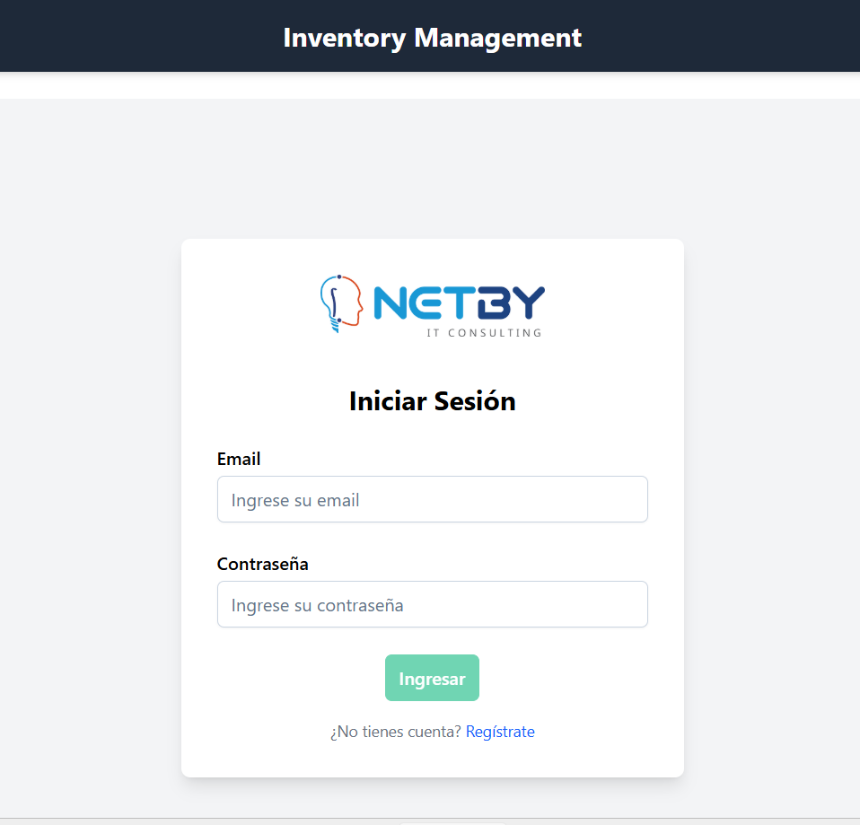
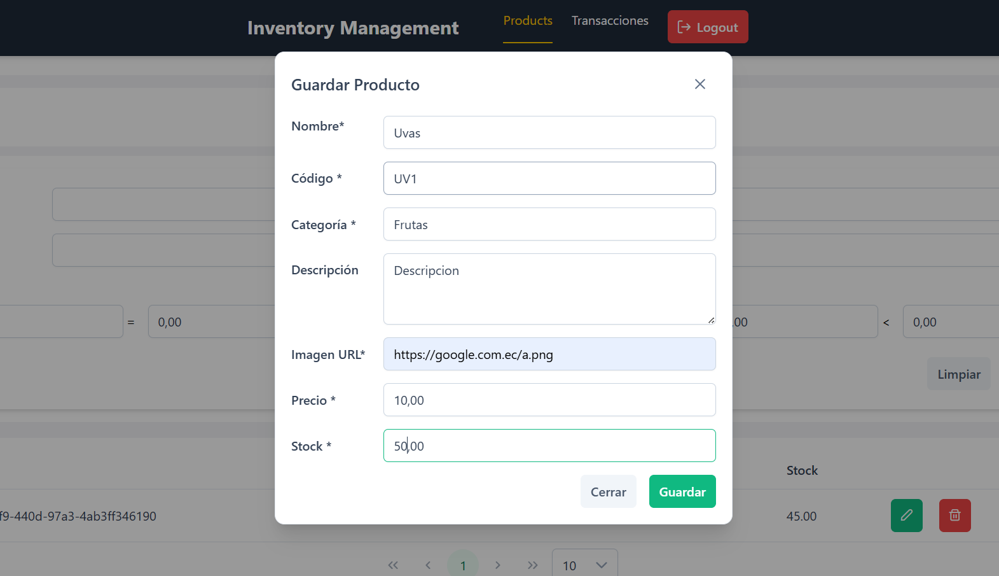
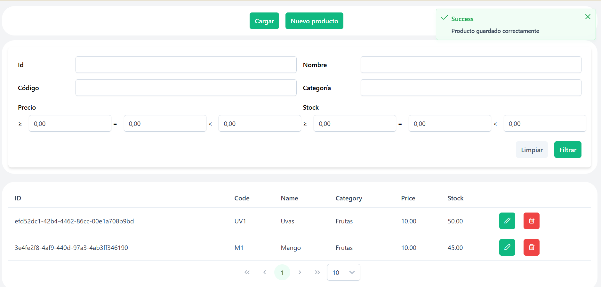
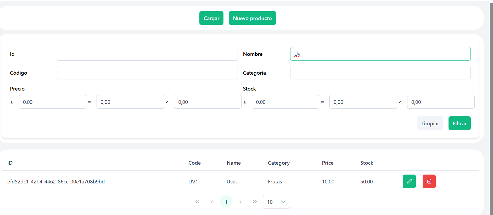
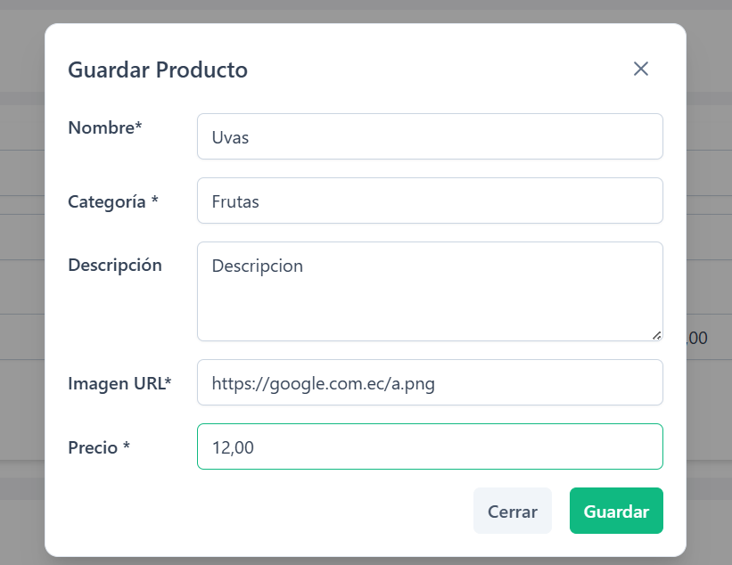
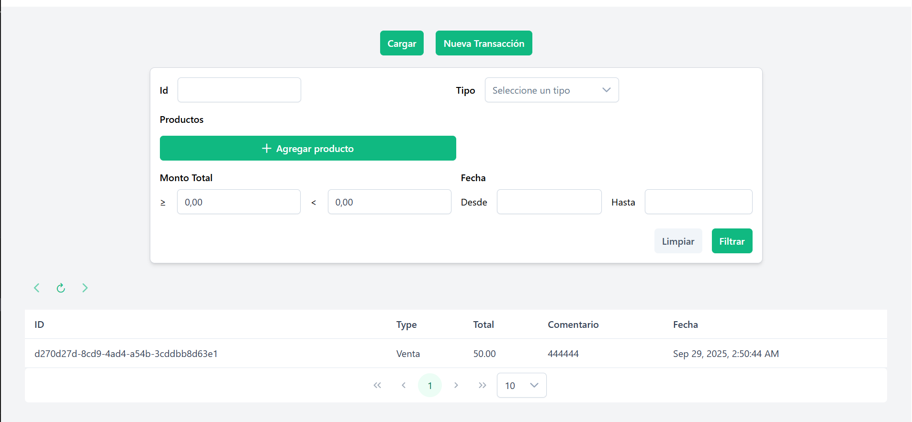
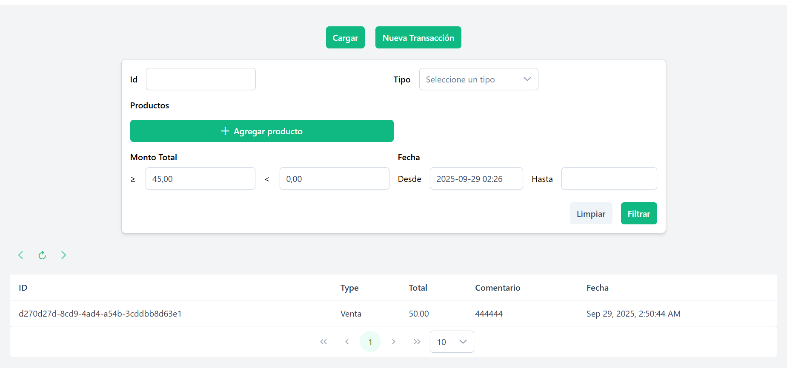

# 🏪 NetBy - Sistema de Gestión de Inventario

Link de pruebas 
> ### 🚀 **¡Prueba NetBy en línea!**
>
> [🔗 Accede aquí a la demo](https://netby.drkapps.com/login)
>
> _Explora todas las funcionalidades del sistema directamente desde tu navegador._

[](https://angular.io/)
[](https://dotnet.microsoft.com/)
[](https://www.docker.com/)
[](https://kubernetes.io/)
[](https://helm.sh/)

Un sistema completo de gestión de inventario construido con arquitectura de microservicios, desplegado en Kubernetes usando Helm para el backend y Docker para el frontend.


## 🚀 Descripción del Proyecto

NetBy es una aplicación moderna de gestión de inventario que implementa:

- **🔐 Autenticación y Autorización** - Microservicio de gestión de usuarios
- **📦 Gestión de Productos** - CRUD completo con filtros avanzados y control de stock
- **💳 Gestión de Transacciones** - Sistema de transacciones con control de concurrencia
- **🎨 Frontend Moderno** - Aplicación Angular con TailwindCSS y PrimeNG
- **🐳 Containerización** - Docker y Kubernetes ready
- **⚡ Cache Distribuido** - Redis para optimización de rendimiento

## 🏗️ Arquitectura

```
┌─────────────────────────────────────────────────────────────┐
│                    🌐 Frontend (Angular)                    │
│                   Docker Container                          │
└─────────────────────────────────────────────────────────────┘
                               │
                    ┌─────────────────┐
                    │   🚪 Kong       │
                    │   API Gateway   │
                    └─────────────────┘
                               │
        ┌──────────────────────┼──────────────────────┐
        │                      │                      │
┌──────────────┐    ┌──────────────┐    ┌──────────────┐
│   🔐 MsAuth   │    │ 📦 MsProducts │    │💳 MsTransactions│
│   (.NET 8.0)  │    │   (.NET 8.0)  │    │   (.NET 8.0)  │
│  Helm Chart   │    │  Helm Chart   │    │  Helm Chart   │
└──────────────┘    └──────────────┘    └──────────────┘
        │                      │                      │
        └──────────────────────┼──────────────────────┘
                               │
                    ┌─────────────────┐
                    │   🗄️ SQL Server │
                    │      Redis      │
                    └─────────────────┘
```

### 🛠️ Stack Tecnológico

#### Backend
- **.NET 8.0** - Framework principal
- **Entity Framework Core** - ORM
- **SQL Server** - Base de datos principal
- **Redis** - Cache y bloqueos distribuidos
- **RedLock** - Control de concurrencia
- **Swagger/OpenAPI** - Documentación de APIs

#### Frontend  
- **Angular 20.3.0** - Framework SPA
- **TailwindCSS 4.1.13** - Estilos utilitarios
- **PrimeNG 20.1.2** - Componentes UI
- **RxJS** - Programación reactiva
- **TypeScript 5.9.2** - Tipado estático

#### DevOps & Infraestructura
- **Docker** - Containerización
- **Kubernetes** - Orquestación
- **Helm 3.x** - Gestión de paquetes K8s
- **Kong** - API Gateway
- **Makefile** - Automatización de tareas

## 📋 Prerequisitos

### Herramientas Requeridas
- **Docker** >= 20.10
- **Kubernetes** >= 1.20 (Minikube, Docker Desktop, o cluster)
- **Helm** >= 3.8
- **kubectl** configurado
- **Node.js** >= 20 (para desarrollo frontend)
- **.NET SDK** >= 8.0 (para desarrollo backend)

### Verificar Instalación
```bash
# Verificar Docker
docker --version

# Verificar Kubernetes
kubectl version --client

# Verificar Helm
helm version

# Verificar acceso al cluster
kubectl cluster-info
```

## 🚀 Guía de Despliegue

### 1. 📥 Clonar el Repositorio

```bash
git clone https://github.com/jsalasx/netby.git
cd netby
```

### 2. 🗄️ Configurar Infraestructura Base

#### Instalar Redis
```bash
# Agregar repositorio Bitnami
helm repo add bitnami https://charts.bitnami.com/bitnami
helm repo update

# Instalar Redis
make create-redis
```

#### Instalar Kong API Gateway
```bash
# Instalar Kong
make kong-install
```

### 3. 🐳 Construir y Desplegar Backend (Helm)

### Contruir las imagenes

## Imagen de Microservicio de Productos
```bash
# Contruir imagenes 
make build-msproducts
```
## Imagen de Microservicio de Transaciones
```bash
# Contruir imagenes 
make build-mstransactions
```

## Imagen de Microservicio de Autenticacion
```bash
# Contruir imagenes 
make build-msauth
```

### Opcional Subir a un Container Registry 

Si el despligue es en la nube

#### Despliegue de Manifiestos de Kubernetes
```bash
# instalar los manifiestos con Helm
make helm-install
```


### 4. 🎨 Desplegar Frontend (Docker)

#### Construir Imagen Docker
```bash
cd frontend/inventory-fe

# Construir la imagen
docker build -t inventory-fe:latest .
```

```bash

# Construir la imagen
docker run -d -p 4200:80 --name inventory-fe inventory-fe:latest
```

### 5. ✅ Verificar Despliegue

```bash
# Verificar pods del backend
kubectl get pods -n netby-inventory

# Verificar servicios
kubectl get services -n netby-inventory

# Verificar frontend
kubectl get pods,services -l app=inventory-fe

# Ver logs si hay problemas
kubectl logs -l app=ms-products -n netby-inventory
```

## 🔧 Comandos de Gestión

### Backend (Helm)
```bash
# Actualizar despliegue
make helm-upgrade

# Desinstalar completamente
make helm-uninstall

# Ver status
helm status netby-inventory -n netby-inventory
```

### Desarrollo Local
```bash
# Ejecutar backend en desarrollo
cd MsProducts
dotnet run

# Ejecutar frontend en desarrollo  
cd frontend/inventory-fe
npm install
ng serve
```

## 🌐 Acceso a la Aplicación

### URLs por Defecto
- **Frontend**: `http://localhost:4200` (si usas LoadBalancer)
- **API Products**: `http://localhost/api/products`
- **API Auth**: `http://localhost/api/auth`  
- **API Transactions**: `http://localhost/api/transactions`
- **Swagger Products**: `http://localhost/swagger` (en desarrollo)

## 📊 Características Principales

### 🔐 Autenticación (MsAuth)
- Registro y login de usuarios
- JWT tokens
- Gestión de sesiones

### 📦 Gestión de Productos (MsProducts)  
- CRUD completo de productos
- Filtros avanzados (nombre, categoría, precio, stock)
- Paginación
- Control de stock con RedLock
- Validaciones de negocio

### 💳 Transacciones (MsTransactions)
- Sistema de transacciones
- Control de concurrencia
- Historial de operaciones

### 🎨 Frontend Features
- Dashboard responsive
- Gestión de productos con DataTable
- Formularios reactivos
- Navegación con routing
- Componentes PrimeNG
- Estilos TailwindCSS

## 🐛 Troubleshooting

### Problemas Comunes

#### 1. Pods en estado `ImagePullBackOff`
```bash
# Verificar que las imágenes se construyeron
docker images | grep -E "(msproducts|msauth|mstransactions|inventory-fe)"

# Reconstruir imagen
make build-msproducts  # o el microservicio correspondiente
```

#### 2. Error de conexión a base de datos
```bash
# Verificar SQL Server
kubectl get pods -n netby-inventory | grep sql

# Verificar variables de entorno
kubectl describe pod <pod-name> -n netby-inventory
```

#### 4. Problemas con Redis
```bash
# Verificar Redis
kubectl get pods | grep redis

# Test conexión
kubectl exec -it my-redis-master-0 -- redis-cli ping
```

### Logs y Debugging
```bash
# Logs de microservicios
kubectl logs -f deployment/ms-products -n netby-inventory
kubectl logs -f deployment/ms-auth -n netby-inventory
kubectl logs -f deployment/ms-transactions -n netby-inventory

# Logs de frontend
kubectl logs -f deployment/inventory-fe

# Describir recursos
kubectl describe deployment ms-products -n netby-inventory
```

## 🔄 CI/CD y Automatización

### Scripts Make Disponibles
```bash
make create-redis      # Instalar Redis
make kong-install      # Instalar Kong Gateway
make build-all
make helm-install      # Instalar aplicación completa
make helm-upgrade      # Actualizar despliegue
make helm-uninstall    # Desinstalar aplicación
```

## 📝 Variables de Entorno

### Backend (.NET)
```bash
DB_CONNECTION=Server=...;Database=...;
REDIS_CONNECTION=localhost:6379
ASPNETCORE_ENVIRONMENT=Production
```

### Frontend (Angular)
```bash
API_BASE_URL=http://localhost:4200/api
ENVIRONMENT=production
```

## 🤝 Contribuir

1. Fork el proyecto
2. Crear una rama feature (`git checkout -b feature/AmazingFeature`)
3. Commit los cambios (`git commit -m 'Add some AmazingFeature'`)
4. Push a la rama (`git push origin feature/AmazingFeature`)
5. Abrir un Pull Request

## 📄 Licencia

Este proyecto está bajo la Licencia MIT - ver el archivo [LICENSE.md](LICENSE.md) para detalles.

## 👥 Equipo

- **Desarrollador Principal**: [@jsalasx](https://github.com/jsalasx)

## 🆘 Soporte

Si encuentras algún problema o tienes preguntas:

1. Revisa la sección [Troubleshooting](#🐛-troubleshooting)
2. Busca en los [Issues existentes](https://github.com/jsalasx/netby/issues)
3. Crea un [nuevo Issue](https://github.com/jsalasx/netby/issues/new) si es necesario

---

⭐ Si te gusta este proyecto, ¡dale una estrella en GitHub!

## Evidencias

## Descripciones de Evidencias

- **Login:** Pantalla de inicio de sesión donde los usuarios pueden autenticarse en el sistema.

- **Guardar Productos:** Interfaz para agregar o editar productos en el inventario, mostrando validaciones y campos requeridos.

- **Listado:** Vista general del inventario con todos los productos registrados, incluyendo paginación y filtros básicos.

- **Filtrado:** Ejemplo de uso de filtros avanzados para buscar productos por nombre, categoría, precio o stock.


- **Editar Producto:** Formulario para modificar la información de un producto existente, con controles de validación.

- **Listado Transacciones:** Visualización de todas las transacciones realizadas, con detalles y opciones de búsqueda.

- **Filtrado Transacciones:** Aplicación de filtros para consultar transacciones por fecha, tipo o usuario.

- **Creación Transacciones:** Proceso para registrar una nueva transacción en el sistema, mostrando los campos y controles necesarios.

